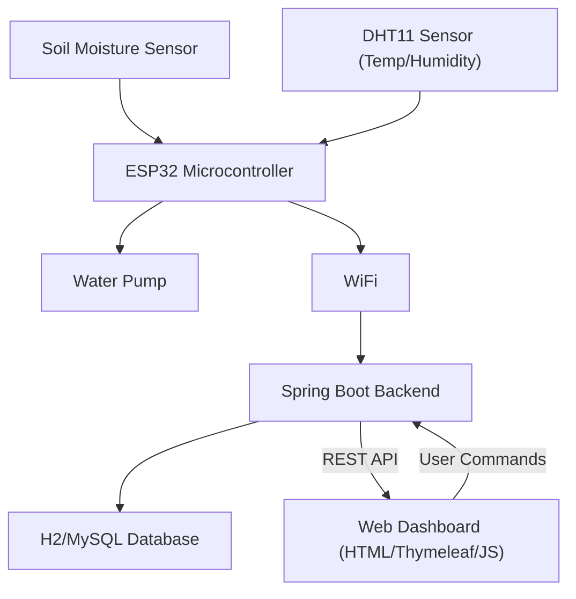

-----

# 🌿 SMART IoT Plant System (AgroGuard)

This project, named **AgroGuard**, is an innovative **Smart Plant Care System** that leverages Internet of Things (IoT) technologies to automate and simplify plant maintenance. Designed primarily for students and small-scale plant enthusiasts, it ensures optimal growth conditions by continuously monitoring environmental variables and automating watering.

-----

## 🌟 Features

  * **Real-time Environmental Monitoring:** Tracks crucial plant conditions including **soil moisture**, **temperature**, and **humidity**.
  * **Automated Watering System:** Activates a water pump based on predefined soil moisture thresholds, ensuring plants receive the right amount of water.
  * **Web-Based Dashboard:** A user-friendly interface for remote monitoring of sensor data and manual control of the watering system.
  * **Sustainable Water Usage:** Optimizes irrigation schedules to reduce water waste, contributing to eco-conscious gardening.
  * **Scalable & Low-Cost:** Built with widely available and cost-effective components, making it accessible for personal use or educational purposes.
  * **Alerts & Notifications:** (Future Enhancement) Potential for real-time alerts on critical changes.

-----

## 💡 Problem Solved

Many plant owners, especially students with busy schedules, struggle with consistent plant care, leading to overwatering or underwatering. This system aims to mitigate these common issues by providing an intelligent, automated solution that reduces manual intervention, promotes healthier plant growth, and fosters sustainable gardening practices.

-----

## 🛠️ Technologies Used

The AgroGuard system is a full-stack IoT solution integrating various hardware and software components:

### Hardware

  * **Microcontroller:** ESP32
  * **Sensors:** DHT11 (Temperature & Humidity), Capacitive Soil Moisture Sensor
  * **Actuators:** Relay Module, DC Water Pump

### Firmware

  * **Platform:** Arduino IDE
  * **Language:** C++
  * **Libraries:** WiFi, HTTPClient

### Backend

  * **Language:** Java
  * **Framework:** Spring Boot
  * **Database:** H2 (In-memory for development/testing), MySQL (for production deployment)
  * **ORM:** Spring Data JPA
  * **API Format:** RESTful API using JSON

### Frontend

  * **Languages:** HTML, JavaScript
  * **Templating Engine:** Thymeleaf
  * **CSS Framework:** Bootstrap 5
  * **Charting Library:** Chart.js

-----

## ⚙️ System Architecture

The system follows a layered architecture to ensure robust and scalable operation:

1.  **Hardware Layer:** Sensors collect data, which the ESP32 processes. The ESP32 also controls the water pump via the relay.
2.  **Firmware Layer:** The Arduino firmware on the ESP32 reads sensor data, applies basic control logic, and sends data to the backend server via WiFi using HTTP requests.
3.  **Backend Layer:** A Java Spring Boot application receives sensor data, stores it in the database, and exposes RESTful APIs for the frontend.
4.  **Frontend Layer:** A web-based dashboard fetches data from the backend APIs, visualizes it, and allows users to interact with the system (e.g., manually activate the pump).

-----

## 📈 Usage

  * **Dashboard Access:** Open the web dashboard in your browser to view real-time soil moisture, temperature, and humidity readings.
  * **Automated Watering:** The system will automatically activate the pump when soil moisture drops below the configured threshold.
  * **Manual Control:** You can manually activate/deactivate the water pump from the dashboard if needed.

-----

## ✉️ Contact

For any inquiries or feedback, please open an issue on GitHub.

-----
